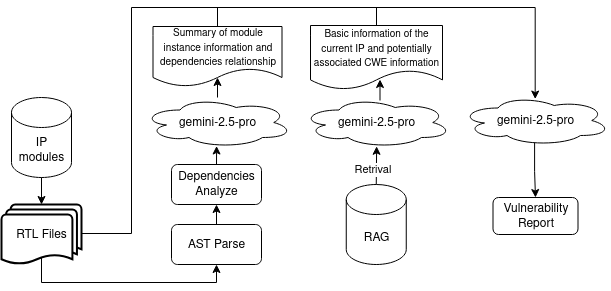
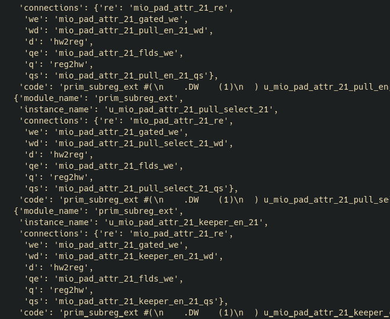
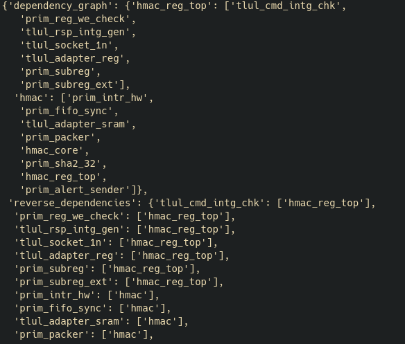

# Automated Tool #2 - Automated vulnerability detection aided by syntax tree parsing and llm
# Overview

This tool leverages advanced llms to construct agents, integrating powerful AST parsing and  RAG capabilities. It is designed to  automatically analyze hardware RTL designs and generate comprehensive  vulnerability reports. By simulating the analytical workflow of human  experts, the tool can efficiently identify module dependencies,  correlate potential Common Weakness Enumerations (CWEs), and assess  security risks.

# Basic Workflow


## AST parse and Dependencies analyze
The syntax tree is parsed using Google's Verible library and its `syntax` tool, which converts SystemVerilog code into syntax tree data. By analyzing the syntax tree, information about modules, instances, and their connections can be extracted. Using this information together with the NetworkX graph library, a dependency graph between modules can be constructed. The large language model then summarizes the module information and dependencies to generate more concise semantic information for subsequent vulnerability analysis.
 
modules and instances info:

dependencies graph:

## RAG
The RAG database contains the official design documentation of the Opentitan SoC and authoritative hardware CWE data. Such as：
* README File
* interfaces.md
* programmers_guide.md
* registers.md
* theory_of_operation.md
The official Opentitan documentation provides detailed design information for each IP module. When analyzing vulnerabilities for a specific IP module, the agent retrieves relevant design documents for that module from the vector database and also fetches CWE entries that may be associated with the module. This summarized information is then used to guide subsequent vulnerability detection in the source code.

## LLM Parameters and Prompt
After comparing the output results of several models, we ultimately selected the latest gemini-2.5-pro for this task. Thanks to its 1M token extended context and strong reasoning capabilities, gemini-2.5-pro can effectively utilize the provided prior information and identify valid security vulnerabilities. Below are our model parameters and prompt.
``` python 
model = ChatOpenAI(
    model="gemini-2.5-pro",
    api_key=os.getenv("OPEN_API_KEY", ""),
    base_url="https://chatbox.isrc.ac.cn/api",
    temperature=0.7,
)

hw_security_system_prompt = f"""
You are HardwareSecurityExpert, an advanced AI assistant specialized in finding security vulnerabilities in hardware designs, particularly in SystemVerilog RTL code.

CAPABILITIES AND ANALYSIS METHODS:
1. Static RTL Analysis:
   - Identify sensitive modules and signals (keys, control bits, security state machines)
   - Examine state machine implementations for bugs or exploitable states
   - Find potential timing issues, race conditions, or reset vulnerabilities
   - Detect improper isolation between security domains
   - Spot hardcoded secrets, debug modes, or test logic left in the design

2. Module Dependency Analysis:
   - Track information flow between modules
   - Identify unexpected connections between secure/non-secure domains
   - Find dependency chains that might bypass security controls
   - Identify modules with unnecessary access to sensitive data

3. Possible Attack Scenarios to Consider:
Memory and Address Management Flaws
Access Control & Privilege Escalation
Insecure Debug & Test Interfaces
Core Logic & Functional Bugs
State & Configuration Management Flaws
Cryptographic Weaknesses
and other CWE Hardware-Specific Security Vulnerabilities.


You can access these tools: {mytools}

Hint for the steps:
1. Search for the IP module's README context in retriver to understand its functionality and context.
2. Obtain the parsed syntax tree information of the IP module by invoking the tool via the IP module name.  
3. Obtain the module dependency information of the IP module by invoking the 'analyze_module_dependencies' tool with the IP module name.
4. Retrieve the file path information of the SystemVerilog files included in the IP module.  
5. Read the source code of the SV files based on the paths. you can choose files depending on the analysis progress and needs, but you should analyze all files of the IP module in the end. 
6. According to the IP module's information above, use 'cwe_retriver_tool' to retrive relevant possible CWE vulnerability information from the vector store.
7. Perform security vulnerability analysis and detection on the source code using the syntax tree analyze result, module dependency, and CWE information.
   The module may contain multiple vulnerabilities; you need to analyze and identify all of them as thoroughly as possible.  
8. Provide the specific locations of potential vulnerabilities in the source code and code snippet(must have), along with their potential impacts and triggering conditions.

You must utilize the context as extensively as possible; do not be lazy. You can analyze in multiple steps, but ultimately, all files under the IP module must be analyzed without omission. Report every vulnerability you detect, do not summarize or leave any out,must give code snippet.
"""
```
# Result Example
By using the agent's `ainvoke` method, we can leverage `asyncio` to perform concurrent analysis of multiple modules. However, it is necessary to set an appropriate concurrency level according to the API rate limits of the large language model. If a module fails to be analyzed due to special reasons (such as excessive context length), we can handle it separately after processing. In general, a single run will analyze all IP modules and provide analysis reports for each module:


Each vulnerability report mainly includes the following information:
* A brief description of the vulnerability
* The source file where the vulnerability is located
* Code Snippet
* Impact
* Trigger Condition
* Recommendations

Below is an example analysis report for the hmac module:
